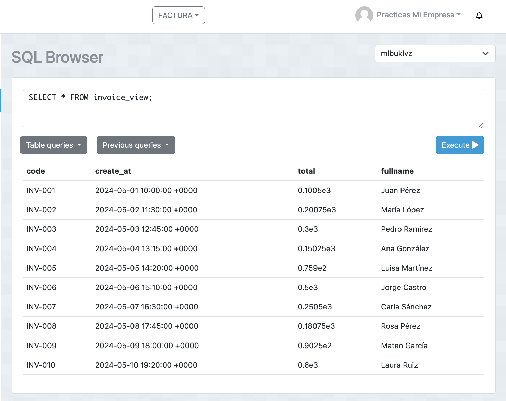
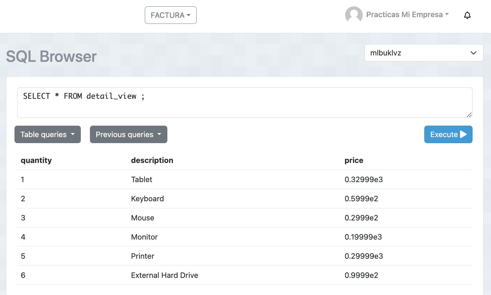

# Tarea Invoice
## 1. Crear vista para invoice_view.
  - Sentencia:
  ```
CREATE VIEW invoice_view AS
SELECT 
    i.code, 
    i.create_at, 
    i.total, 
    c.fullname
FROM 
    invoice AS i
JOIN 
    client AS c ON c.id = i.client_id; 

  ```
  - Captura:



## 2. Crear vista para detail_view
  - Sentencia:
  ```
  CREATE VIEW detail_view AS
SELECT 
    d.quantity, 
    p.description, 
    d.price
FROM 
    detail AS d
JOIN 
    product AS p ON p.id = d.product_id;
  ```
  - Captura:

